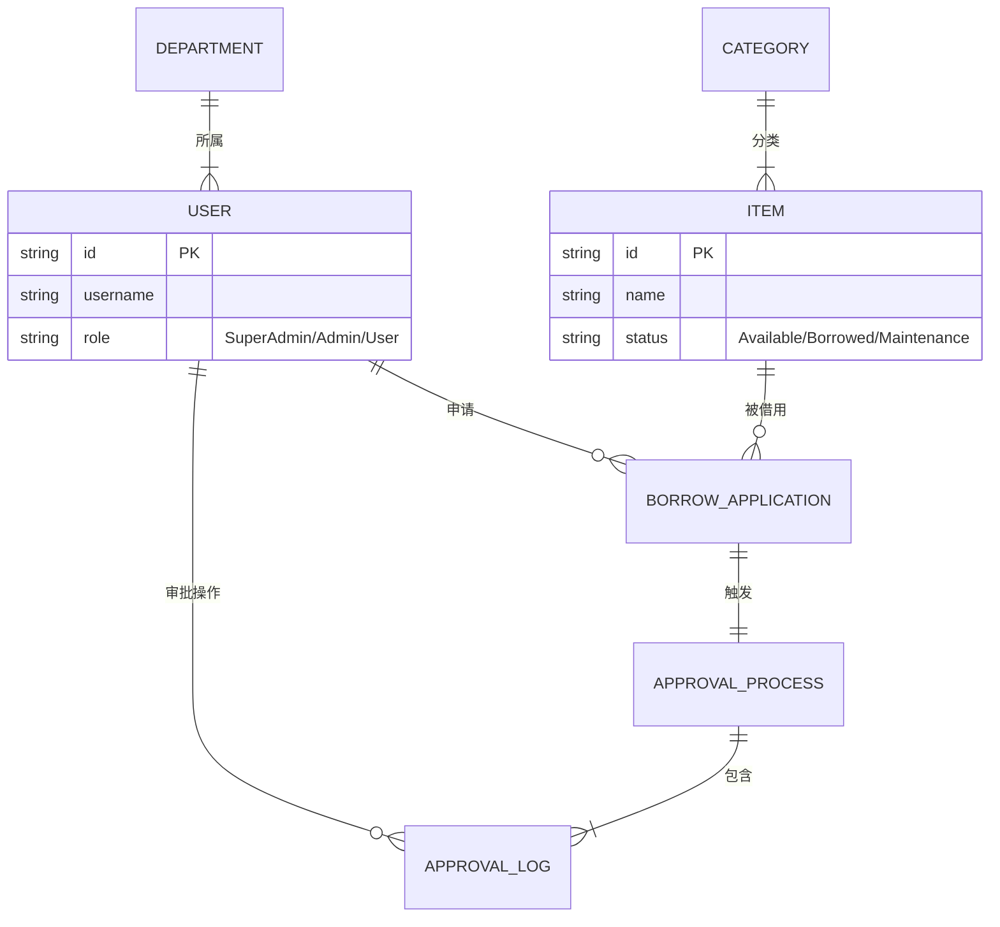
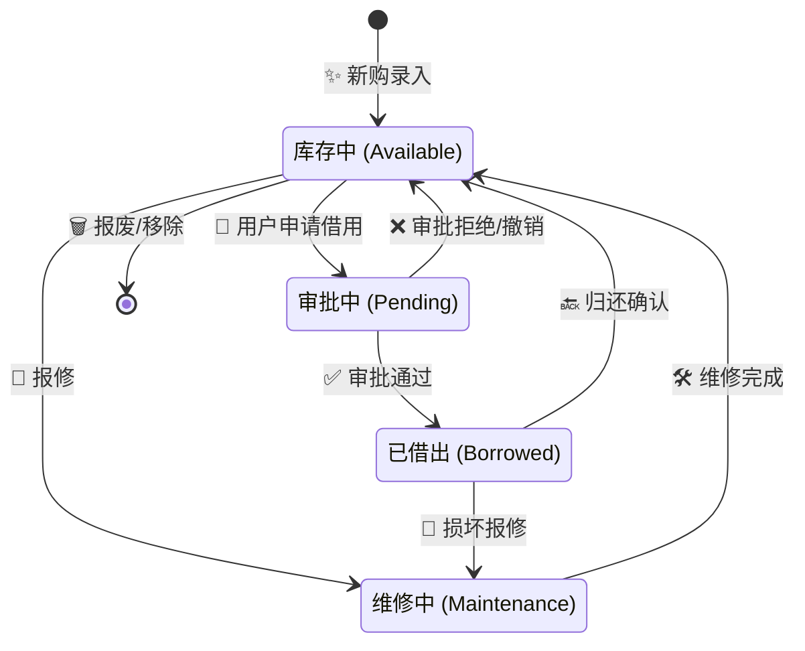
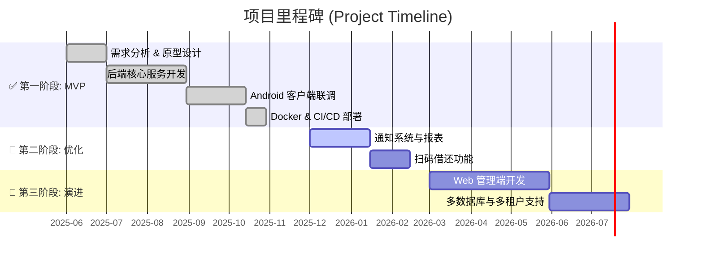

# EquipTrack - 企业级物资追踪与管理系统

> [!TIP]
> **EquipTrack** 是一套现代化的全栈物资管理解决方案，专为企业和组织设计，旨在解决设备资产管理混乱、借还记录不透明、审批流程繁琐等痛点。

---

## 📊 系统可视化概览 (System Visualization)

### 1. 🏗️ 系统架构图 (Architecture)
本系统采用经典的前后端分离架构，通过 RESTful API 进行通信。后端采用轻量级文件存储方案，易于部署和迁移。

```mermaid
graph TD
    User[👤 用户] -->|操作界面| Client[📱 Android 客户端]
    Client -->|REST API (JSON)| Gateway[🌐 API 网关 / Express]
    
    subgraph "后端服务器 (Node.js)"
        Gateway --> Auth[🔐 认证服务]
        Gateway --> Inventory[📦 库存服务]
        Gateway --> Workflow[🔄 审批流引擎]
        Gateway --> FileMgr[📁 文件管理器]
    end
    
    subgraph "数据持久层 (Local Storage)"
        Auth <--> JSON[(📄 JSON 数据库)]
        Inventory <--> JSON
        Workflow <--> JSON
        FileMgr <--> Disk[(💾 磁盘文件/图片)]
    end
```

### 2. 🧩 核心数据模型 (ER Diagram)
系统核心实体关系如下，展示了用户、部门、物资与借还流程的关联。



### 3. 🔄 物资全生命周期状态机 (Lifecycle)
物资从录入到报废的全流程状态流转逻辑。



---

## 📅 开发路线与进度 (Roadmap)



### ✅ 第一阶段：核心功能 MVP (Current)
- [x] **基础设施**: Docker 容器化部署、GitHub Actions CI/CD
- [x] **用户体系**: JWT 身份认证、RBAC 角色权限控制 (SuperAdmin, Admin, User)
- [x] **物资管理**: 物资增删改查、图片上传、自定义分类
- [x] **业务流程**: 借用申请、多级审批流、归还闭环
- [x] **数据存储**: 基于 JSON 的本地文件数据库 (无需安装 MySQL/Mongo)

### 🚧 第二阶段：体验优化 (In Progress)
- [ ] **通知系统**: 审批状态变更邮件/消息推送
- [ ] **数据报表**: 部门借用统计图表、物资利用率分析
- [ ] **移动端升级**: 支持扫码 (QR Code) 快速借还

### 🔮 第三阶段：企业级演进 (Future)
- [ ] **Web 管理端**: 基于 React/Vue 的桌面端管理大屏
- [ ] **数据库迁移**: 支持 SQLite/PostgreSQL 插件化切换
- [ ] **多租户支持**: 支持多组织/多公司隔离部署

---

## 🛠️ 技术栈构成 (Tech Stack)

| 领域 | 技术/工具 | 说明 |
| :--- | :--- | :--- |
| **移动端** | **Android (Kotlin)** | Jetpack Compose / XML, Retrofit, Coroutines |
| **后端** | **Node.js (TypeScript)** | Express, Multer, JSON Web Token |
| **存储** | **LowDB / JSON** | 轻量级本地文件存储，自动备份 |
| **运维** | **Docker** | 容器化封装，支持 docker-compose 一键部署 |
| **CI/CD** | **GitHub Actions** | 自动化构建与 Docker Hub 推送 |

---

## 📂 目录结构深度解析

> **说明**：本仓库主要包含 Android 客户端代码及项目文档。后端服务器代码请访问独立仓库：[HF-CYGG-equiptrack-server](https://github.com/HF-CYGG/HF-CYGG-equiptrack-server)。

```text
studio-main/
├── android/              # Android 客户端原生工程
│   ├── app/              # 核心应用模块
│   └── build.gradle      # Gradle 构建配置
├── server/               # 后端服务器工程
│   ├── src/              # TypeScript 源代码
│   │   ├── config/       # 环境变量与系统配置
│   │   ├── middlewares/  # 认证、上传、错误处理中间件
│   │   ├── models/       # TypeScript 类型定义与数据模型
│   │   ├── routes/       # API 路由分发
│   │   ├── services/     # 核心业务逻辑 (Service Layer)
│   │   ├── utils/        # 工具函数 (数据持久化等)
│   │   ├── app.ts        # Express 应用实例配置
│   │   └── index.ts      # 服务器启动入口
│   ├── data/             # (运行时生成) 本地 JSON 数据库文件
│   ├── uploads/          # (运行时生成) 图片上传存储目录
│   ├── Dockerfile        # Docker 容器构建描述文件
│   └── package.json      # Node.js 依赖管理
└── API_SPEC.md           # 详细的 RESTful API 接口文档
```

---

## ✨ 核心功能模块详情

### 1. 👮 用户与权限管理
*   **多角色体系**：
    *   **超级管理员**: 全局掌控，管理所有部门与审批。
    *   **部门管理员**: 仅管理本部门物资与人员。
    *   **普通用户**: 自助查询与借用。
*   **注册审批**: 邀请码机制 + 管理员人工审核，确保内部安全。

### 2. 📦 物资数字化管理
*   **档案管理**: 完整记录物资参数、购买日期、保修状态。
*   **状态追踪**: 实时呈现物资流转状态（借出人、归还时间）。
*   **可视化**: 支持多图上传，直观展示物资外观。

### 3. 🔄 智能审批流
*   **自动路由**: 根据申请人所属部门，自动将审批任务推送到对应管理员。
*   **完整日志**: 记录每一步审批操作的时间、人员和备注。

---

## 🚀 后端部署指南 (Server Deployment)

### 环境准备
*   **运行环境**: Node.js v18+
*   **包管理器**: npm 或 yarn

### 方式一：Docker 容器化部署 (强烈推荐)

本项目已深度优化 Docker 支持，集成国内镜像源加速构建。

1.  **构建镜像**
    ```bash
    # 在 server 目录下执行
    docker build -t equiptrack-server .
    ```

2.  **启动容器** (包含数据持久化挂载)
    ```bash
    docker run -d \
      --name equiptrack-server \
      --restart always \
      -p 3000:3000 \
      -e TZ=Asia/Shanghai \
      -v /opt/equiptrack/data:/app/data \
      -v /opt/equiptrack/uploads:/app/uploads \
      yemiao351/equiptrack-server:latest
    ```

### 方式二：本地开发运行

1.  **安装依赖**
    ```bash
    cd server
    npm install
    # 国内推荐: npm config set registry https://registry.npmmirror.com
    ```

2.  **启动服务**
    ```bash
    npm run dev   # 开发模式
    npm run build && npm start # 生产模式
    ```

---

## 📱 Android 客户端开发指南

1.  **工具**: Android Studio (Koala+)
2.  **运行**: 导入 `android` 目录，Sync Gradle，连接真机运行。
3.  **配置**: 修改 `BASE_URL` 指向你的服务器 IP (如 `http://192.168.1.100:3000/api/`)。

---

## 🤝 贡献与支持

欢迎提交 Issue 或 Pull Request 来改进本项目。

*   **API 文档**: [API_SPEC.md](./API_SPEC.md)
*   **维护者**: EquipTrack Team
